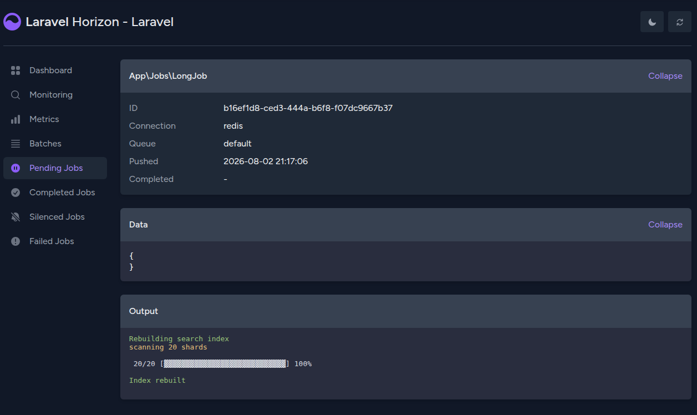

# Job Output for Laravel Horizon

Give a queued job the same output API an Artisan command has, and watch it live on
the Horizon job details page.



```php
use Knobik\HorizonJobOutput\Concerns\WritesJobOutput;

class RebuildSearchIndex implements ShouldQueue
{
    use Queueable;
    use WritesJobOutput;

    public function handle(): void
    {
        $this->info('Rebuilding search index');
        $this->comment('scanning 20 shards');

        $this->withProgressBar($shards, fn ($shard) => $shard->rebuild());

        $this->info('Index rebuilt');
    }
}
```

`info()`, `line()`, `comment()`, `error()`, `table()`, `newLine()` and
`withProgressBar()` all work exactly as they do in a command — the trait uses
Laravel's own `InteractsWithIO`.

The interactive prompts (`ask()`, `confirm()`, `choice()`, …) throw instead. A
queue worker has no input stream, so they would otherwise block until the job
timed out.

## Reserved Jobs page

The package also adds a **Reserved Jobs** page to the dashboard sidebar, listing
the jobs the workers are holding right now — something Horizon has no view of.
Reserved jobs are otherwise mixed into the pending list with nothing to set them
apart.

It reads the queue's own reserved set rather than Horizon's pending list, so its
cost tracks the number of workers rather than the size of the backlog. That set
also carries each reservation's deadline, so a job whose worker died is listed
with a **Reservation expired** badge until Horizon releases it back onto the
queue — the one case you would open this page to diagnose, and one nothing else
surfaces.

Rows link through to the job details page, and any job with live output is
flagged so you know there is something to look at.

Set `reserved_page` to `false` to leave Horizon's navigation untouched.

## Installation

```bash
composer require knobik/laravel-horizon-job-output
```

That is the whole setup. The service provider is auto-discovered, and the panel
adds itself to Horizon's dashboard.

## How it works

Output is stored as a field on **Horizon's own job hash** in Redis, rather than
under a key of its own. That means it shares one key and one TTL with the job, so
it is trimmed by Horizon's existing `horizon.trim.*` settings with no cleanup
code, no scheduled command, and no way for the two to fall out of sync.

Three integration points, none of which require changes to Horizon:

- `RedisJobRepository::$keys` is a public whitelist read with `HMGET`. The
  provider appends `output` to it, so the field flows through the existing
  `/api/jobs/{id}` endpoints with no controller or route overrides.
- A global bus pipe attaches the output instance while the job runs. Unserialized
  jobs never run their constructor, so this cannot be done at dispatch time.
- The `horizon::layout` view is overridden to inject the panel. Rather than
  shipping a copy that drifts, the override renders Horizon's real layout and
  patches a few anchors in the result — which is also how the Reserved Jobs page
  adds its sidebar link, since Horizon's router is compiled into its bundle.

Every one of those patches is optional. If Horizon changes the markup underneath
them the package logs a warning and leaves that piece out; the dashboard still
renders and jobs still run.

## Configuration

```bash
php artisan vendor:publish --tag=horizon-job-output-config
```

| Option | Default | Purpose |
| --- | --- | --- |
| `enabled` | `true` | Turn capture and the dashboard panel off entirely |
| `reserved_page` | `true` | Show the Reserved Jobs page and its sidebar link |
| `max_bytes` | `65536` | Truncate a runaway job's output |
| `flush_interval_ms` | `500` | How often a running job writes to Redis |
| `poll_interval_ms` | `2000` | How often the dashboard polls while a job runs |
| `ansi` | `true` | Store style tags as colour, rather than plain text |
| `verbosity` | `normal` | `quiet`, `normal`, `v`, `vv` or `vvv` — see below |
| `renderer` | `terminal` | `terminal` or `html` — see below |
| `columns` | `80` | Terminal width; match what the job wrote at |

Setting `enabled` to `false` stops output being recorded and removes the panel,
but jobs using the trait keep working — their `$this->info()` calls simply go
nowhere. Disabling the package never changes whether your jobs run.

### Verbosity

Jobs write at the same levels a command does, named after Artisan's flags. The
level decides two things.

The write helpers take an optional verbosity, and anything above the current
level is discarded — so `$this->info('shard 3 of 20', 'vv')` says nothing at the
default and appears once the level is raised:

```php
$this->info('Rebuilding search index');          // always
$this->line('scanning shard 3', null, 'vv');     // only at vv or above
```

And a progress bar reports more, exactly as it does under `php artisan -vv`,
because Symfony picks the bar's format from the output's verbosity:

```
normal    12/20 [████████████████░░░░░░░░]  60%
v         12/20 [████████████████░░░░░░░░]  60% 4 secs
vv        12/20 [████████████████░░░░░░░░]  60% 4 secs/7 secs
vvv       12/20 [████████████████░░░░░░░░]  60% 4 secs/7 secs 24.0 MiB
```

A single job can override the setting, which is usually the better place for it
— the long job whose progress is worth timing is rarely every job in the
application:

```php
public function outputVerbosity(): ?string
{
    return 'vv';
}
```

`quiet` suppresses everything, progress bars included, so a job at that level
records nothing at all rather than "text but no bars".

### Renderers

`terminal` inlines a vendored [xterm.js](https://xtermjs.org) build and renders
output through a real terminal emulator, so a progress bar redraws in place
exactly as it would in a shell. It adds roughly 345KB to each dashboard page.

`html` renders the output as styled HTML with no extra payload. Sequences that
rewrite the current line are collapsed, so a progress bar shows only its final
state. This is also the automatic fallback if the vendored build is unavailable.

## Running jobs outside Horizon

Writing output is never a reason for a job to fail. Whatever path a job takes,
the write helpers work:

| How the job runs | Output |
| --- | --- |
| Queued, processed by Horizon | captured and shown on the dashboard |
| Queued, processed by `queue:work` | captured — Horizon records the job when it is pushed, not when it runs |
| `dispatchSync()` / `dispatch_sync()` | discarded; there is no Horizon record to attach it to |
| `(new Job)->handle()` directly | discarded |
| Package disabled | discarded |

To assert on output in a test, attach one and read it back:

```php
$job = new RebuildSearchIndex();
$job->setOutput(new OutputStyle(new ArrayInput([]), $buffer = new BufferedOutput()));

$job->handle();

$this->assertStringContainsString('Index rebuilt', $buffer->fetch());
```

The interactive prompts are the one deliberate exception: `ask()`, `confirm()`
and friends throw rather than returning something meaningless, because a worker
has no input stream and they would otherwise block until the job timed out.

## Requirements

- PHP 8.2+
- Laravel 12 or 13
- Laravel Horizon 5

## License

MIT — see [LICENSE.md](LICENSE.md).
